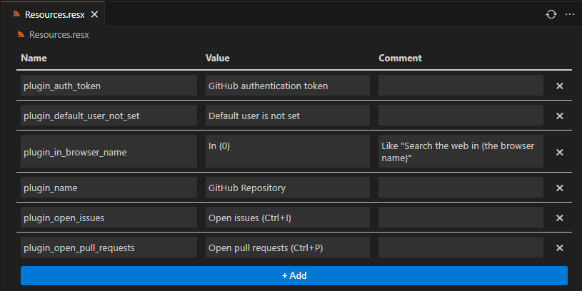

# ResX Editor

A visual editor for .resx files  

WIP

## Features

- Keyboard navigation: <kbd>Tab</kbd>, <kbd>Shift+Tab</kbd> to move left and right, <kbd>Enter</kbd> and <kbd>ArrowDown</kbd> to move down, <kbd>ArrorUp</kbd> to move up.
- Sortable columns: Click on the column header to sort the rows.
- Support redo/undo: redo/undo updates webview accordingly.
